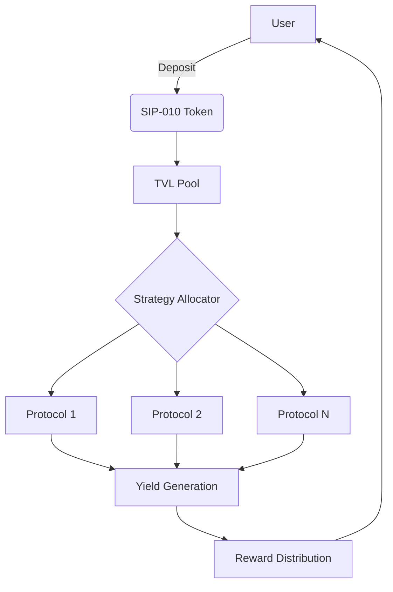
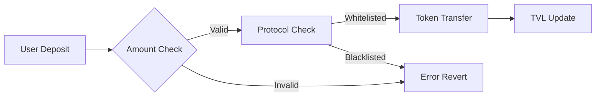

# BitStack Yield Protocol

[](https://opensource.org/licenses/MIT)
**A Secure, Multi-Protocol Yield Aggregation Platform for Bitcoin Assets on Stacks**

---

## 📘 Overview

**BitStack Yield** is a decentralized yield optimization protocol on the [Stacks](https://www.stacks.co/) blockchain. It allows users to deposit SIP-010 compliant tokens and earn maximized returns through dynamic allocation across a curated set of secure DeFi strategies.

Built for both performance and security, BitStack Yield delivers efficient, transparent, and user-friendly yield aggregation with fully on-chain governance and robust risk controls.

---

## 🚀 Key Features

* **Multi-Protocol Aggregation**: Dynamically allocates funds across whitelisted DeFi protocols for optimal yield.
* **SIP-010 Token Support**: Compatible with Stacks fungible token standard.
* **Dynamic Strategy Allocation**: Uses weighted APY performance metrics for capital distribution.
* **Reward Engine**: Calculates and distributes rewards based on block-aware APY.
* **Admin Governance**: All critical operations are permissioned and owner-controlled.
* **Security Layer**:

  * Emergency shutdown
  * Deposit/withdrawal limits
  * Safe token transfers
  * Protocol & token whitelisting

---

## 🧱 Architecture Overview

### System Diagram

```
                          +-------------------------------+
                          |        BitStack Yield         |
                          |         Smart Contract        |
                          +-------------------------------+
                                       |
              +------------------------+------------------------+
              |                                                 |
   +------------------------+                      +------------------------+
   |   SIP-010 Token Layer  |                      |     Admin Controls     |
   |  (Deposit/Withdrawals) |                      |   (Whitelist, Fees)    |
   +------------------------+                      +------------------------+
              |                                                 |
   +------------------------+                      +------------------------+
   | User Balances & Rewards|                      | Whitelisted Protocols  |
   | Deposits, Blocks, APY  |                      |  + Allocation Mgmt     |
   +------------------------+                      +------------------------+
              |                                                 |
              +------------------------+------------------------+
                                       |
                        +------------------------------+
                        |   APY Calculation Engine      |
                        | Weighted APY & Rewards Logic  |
                        +------------------------------+
                                       |
                        +------------------------------+
                        | Protocol Strategy Allocator  |
                        | (Rebalance, Optimize, Track) |
                        +------------------------------+
```

---

### Core Modules

| Component              | Purpose                                             |
| ---------------------- | --------------------------------------------------- |
| **Protocol Registry**  | Manages whitelisted protocols & APY configuration   |
| **Strategy Allocator** | Allocates TVL across protocols by weighted APY      |
| **Reward Engine**      | Computes user rewards with block-based APY logic    |
| **Risk Management**    | Enforces limits, whitelists, and shutdown protocols |
| **Token Gateway**      | Handles SIP-010 deposits and withdrawals securely   |

---

### Workflow



---

## ⚙️ Smart Contract Interface

### 👤 User Functions

| Function               | Description                    |
| ---------------------- | ------------------------------ |
| `deposit(token, amt)`  | Lock SIP-010 tokens into vault |
| `withdraw(token, amt)` | Redeem deposited tokens        |
| `claim-rewards(token)` | Claim accumulated rewards      |
| `get-user-deposit()`   | View user's deposit info       |
| `get-total-tvl()`      | View total value locked        |

### 🔐 Admin Functions

| Function                      | Description                       |
| ----------------------------- | --------------------------------- |
| `add-protocol(id, name, apy)` | Add a whitelisted yield strategy  |
| `update-protocol-status()`    | Enable/disable existing protocol  |
| `update-protocol-apy()`       | Update protocol yield parameters  |
| `set-platform-fee()`          | Configure yield fee (default: 1%) |
| `set-emergency-shutdown()`    | Global halt of deposit functions  |
| `whitelist-token()`           | Approve new SIP-010 token         |

---

## 🧪 Security Architecture

### Control Mechanisms

* **Multi-Signature Admins**: Prevents single-point control over critical parameters
* **Time-Locked Changes**: Adds transparency to updates
* **Input Validation**: Protects against malformed or malicious data
* **Safe Token Transfers**: Wrapped in `try!` and `contract-call?` for atomicity
* **Emergency Shutdown**: Full system halt on risk detection

### Risk Mitigation Flow



---

## 🔧 Configuration Constants

| Constant          | Default Value | Purpose                             |
| ----------------- | ------------- | ----------------------------------- |
| `MAX-PROTOCOL-ID` | 100           | Max allowed strategy index          |
| `MAX-APY`         | 10,000 (100%) | Safety cap for APY                  |
| `PLATFORM-FEE`    | 100 (1%)      | Default protocol fee from earnings  |
| `MIN/MAX-DEPOSIT` | 100,000 / 1B  | Prevents spam and protocol overload |

---

## 📄 Standards & Interfaces

* **Token Compatibility**: Complies with [SIP-010 Fungible Token Standard](https://github.com/stacksgov/sips/blob/main/sips/sip-010/sip-010-token-standard.md)

---

## 🧠 Future Roadmap

* NFT-based deposit position tokens
* Real-time APY auto-adjustments
* Multi-token support in a unified pool
* DAO governance for protocol control
* Third-party audits & bug bounty program

---

## 🤝 Contributing

1. Fork the repo
2. Create a new feature branch
3. Commit with clear messages
4. Push and open a Pull Request
